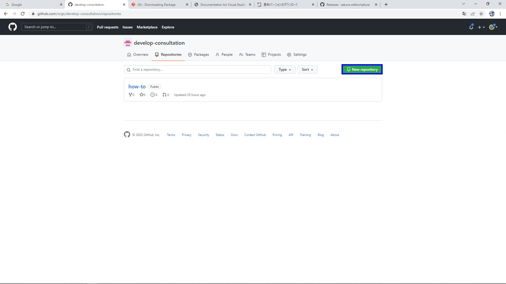
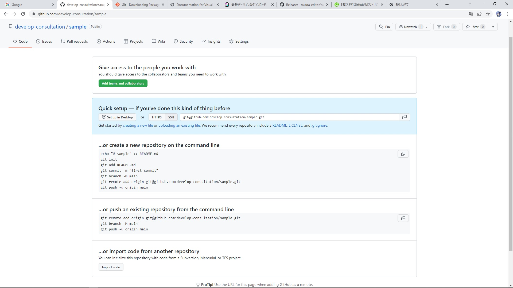
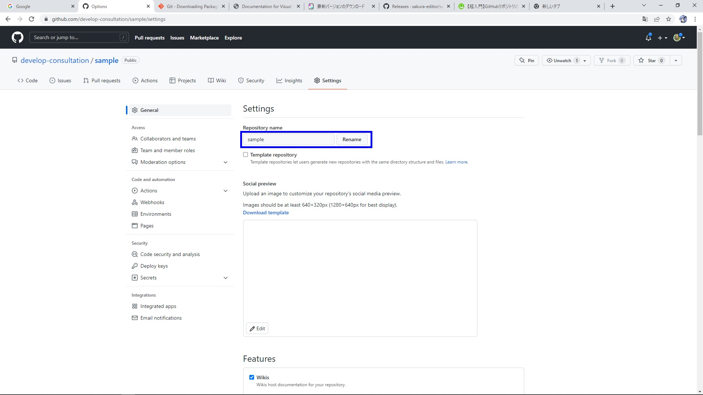
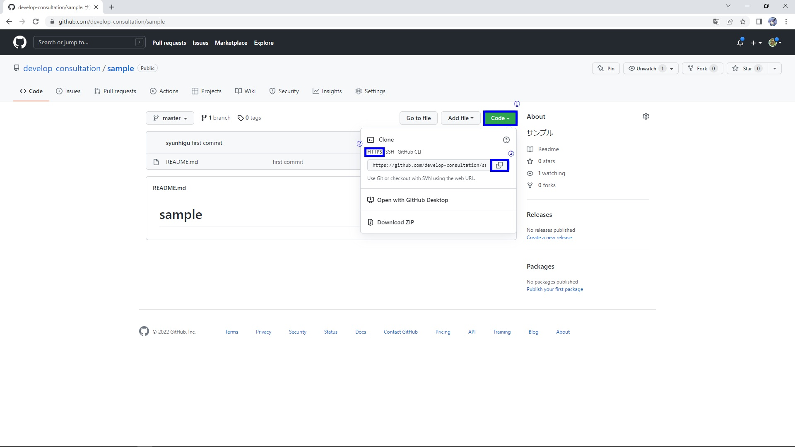
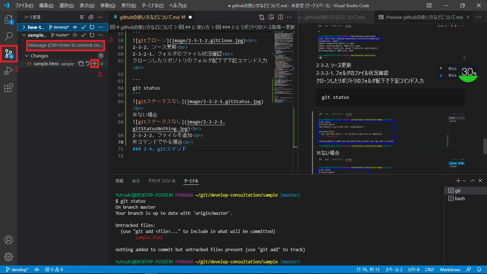

# githubの使い方などについて

## 目次
1. [概要](#1-概要〜githubとは〜)
2. [使い方](#2-使い方)
3. [gitコマンド](#3-gitコマンド)

## 1. 概要〜githubとは〜
GitHubとは、Gitの仕組みを利用して、世界中の人々が自分の作品(プログラムコードやデザインデータなど)を保存、公開できるようにしたウェブサービスの名称。<br>
その名の通り、「Git」の「ハブ：拠点・中心・集まり」という意味である。GitHubは、GitHub社によって運営されており、個人・企業問わず無料で利用が可能。<br>
GitHubに作成されたリポジトリ（保存庫のようなもの）は、基本的にすべて公開されるが、指定したユーザーからしかアクセスができないプライベートなレポジトリを作ったりできる。<br>
また、各プロジェクトにwiki（メモ書き）やタスク管理ツールなど、コラボレーションのための機能も充実しているのが特徴。<br>
※詳細については、[GitHubとは何か](https://www.sejuku.net/blog/7901)参照。<br>
余談として、GitHubには個人向けの他に組織（チーム）でリポジトリ管理するための **「organization」** が存在する。<br>
ここで活用しているサービスは「organization」である。<br>
※詳細については、[Organizationとは](https://tonari-it.com/github-organization/)参照。

## 2. 使い方
### 2-1. 事前準備
  * gitインストール<br>
  →[公式サイト](https://git-scm.com/)よりダウンロード及びインストール
  * エディタのインストール<br>
  →vs codeなど<br>

### 2-2. リポジトリの作成〜削除
2-2-1-1. リポジトリの作成<br>
下記いずれかより実施<br>
  * Overviewより「New」をクリック<br>
  
  * Repositoriesより「New repository」をクリック<br>
  <br>
2-2-1-2. リポジトリ名などの設定<br>
  * Owner: リポジトリ所有者を選択<br>
  1. Repository name: リポジトリの名称<br>
  →あとから変更可能（2-2-1-4）参照
  2. Description: リポジトリの概要(任意)<br>
  3. Public/Private: リポジトリの公開/非公開設定<br>
  4. Initialize this repository with: 予めGitHubがテンプレファイルを用意してくれる(任意)
  
2-2-1-3. セットアップ<br>
※2-2-1-2でREADMEやLICENCEの選択などを行った場合は不要<br>
<br>
2-2-1-4. リポジトリ名変更及び削除<br>
2-2-1-4-1. リポジトリ名変更<br>
<br>
2-2-1-4-2. リポジトリの公開/非公開設定<br>
<br>
2-2-1-4-3. リポジトリの削除<br>
<br>

### 2-3. リポジトリのソース取得〜更新
2-3-1. ソース取得<br>
2-3-1-1. 取得したリポジトリのページで「①Code」→「②HTTPS」→③でリポジトリURLコピー<br>
※取得方式で②の選択は変わる<br>
<br>
2-3-1-2. gitクローン<br>
gitBashやターミナルソフト（Windowsであれば、PowerShellなど）で下記コマンド入力

```
git clone <コピーしたURL>
例
git clone https://github.com/develop-consultation/sample.git
```
<br>
2-3-2. ソース更新<br>
2-3-2-1. フォルダのファイル状況確認<br>
クローンしたリポジトリのフォルダ配下で下記コマンド入力<br>

```
git status
```
<br>
※ない場合<br>
<br>
2-3-2-2. ファイルを追加<br>
vsCodeでやる場合<br>
「①ソース管理」→「②ファイル追加」→「③コメント入力」→ Ctrl+Enterキー押下 →「 Sync Changes」押下<br>
<br>
コマンドでやる場合<br>
クローンしたリポジトリのフォルダ配下で下記コマンド入力<br>

```
①git add <ファイル>
②git commit -m <コメント>
③git push <対象ブランチ>
```
<br>

## 3. gitコマンド
* [【初心者】Gitコマンドの使い方を体系的に覚える【一覧あり】](https://kitsune.blog/git-command)<br>
* [よく使うGitコマンド19選！使い方を初心者向けにわかりやすく解説](https://www.sejuku.net/blog/5816)<br>
* [Gitでよく使うコマンド一覧](https://qiita.com/uhooi/items/c26c7c1beb5b36e7418e)<br>
* [gitコマンド チートシート](https://qiita.com/TaaaZyyy/items/b2b68aec99789374a204)

[トップに戻る](#githubの使い方などについて)