# Dockerインストール及び設定

## 前提条件
* OSはWindows11 Pro  
**※Windows10 Proでも基本は同じ**  
[参考サイト](https://ascii.jp/elem/000/004/127/4127643/)  

## 1. Windos機能有効化
Windowsの機能の有効化または無効化を開く  
* 以下機能にチェックをつける  
  * Hyper-V  
  * Linux用Windowsサブシステム  
  * 仮想マシンプラットフォーム  
**※インストールするWindowsのエディションが「Home」の場合、「Hyper-V」は提供されてないため、下記サイト参考・・・おすすめは①、②**  
[①公式ドキュメント](https://docs.docker.jp/docker-for-windows/install-windows-home.html)  
[②Windows 10 HomeへのDocker Desktop (ver 3.0.0) インストールが何事もなく簡単にできるようになっていた (2020.12時点)](https://qiita.com/zaki-lknr/items/db99909ba1eb27803456)  
[③Hyper-V版DockerからWSL2版Dockerに乗り換えた時にやったことメモ（Previewビルドなし）](https://qiita.com/Ayutanalects/items/129c2bfa23a249505e2e)  
[④Docker for Windows Hyper-VではなくWSL2を使う](https://cfautog.tokyo/2020/11/04/docker-for-windows-wsl2/)  
「Hyper-V」を後から入れる方法（任意）  
[Windows 10や11のHomeエディションでHyper-Vを利用する方法](https://4thsight.xyz/36873)  
[Windows11 Homeで仮想環境（Hyper-V）を作成する方法](https://jo-sys.net/win11home-hyperv/)  
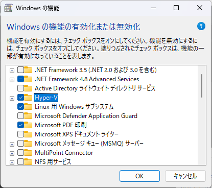  
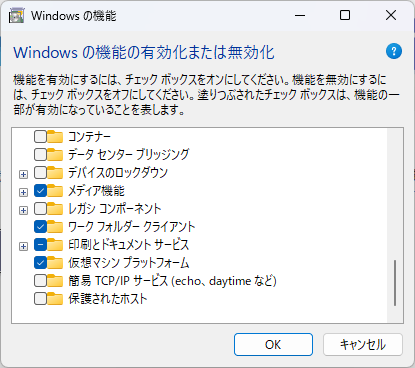

OKボタン押下後、再起動  

## 2. Dockeデスクトップインストール
[Dockerデスクトップ](https://www.docker.com/products/docker-desktop/)よりダウンロード及びインストール  
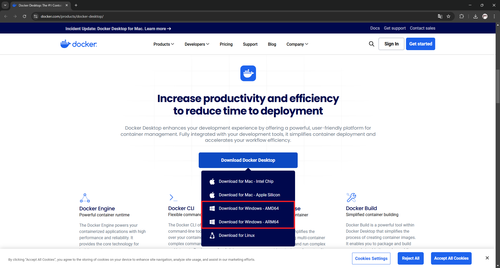  

### 2.1. DLすべきはAMDかARMか？
結論：  
AMD／ARMとは  
プロセッサーのアーキテクチャの種類（名称）  
違いについてはこちらのサイトがわかりやすかったのでメモ。
[OSとCPUのアーキテクチャー ARM x86 x64の違い](https://it-textbook.com/archives/617)  
プロセッサとは？  
→[ハードウェア／CPU](https://wa3.i-3-i.info/word11281.html)  
アーキテクチャとは？  
→[構造](https://wa3.i-3-i.info/word16015.html)  
プロセッサーのアーキテクチャ  
Ubuntuで次のように入力すると  
CPUのアーキテクチャ（処理方式）が確認可能。  
```
ubuntu@syunhigu-carbon:~$ uname -m
x86_64
ubuntu@syunhigu-carbon:~$
```

PC＞設定＞システム＞バージョン情報＞システムの種類でも確認可能で  
```
システムの種類：64 ビット オペレーティング システム、x64 ベース プロセッサ
```

上記の使用しているPCはx86_64。  
つまり、「AMD64」と同義のよう。  
※「x64」と略されることが多い。  
[【学習メモ】Docker環境構築メモ（Windows 11 HOME）](https://qiita.com/OdaAyaka/items/a456c607bb62a38afc86)  
## 3. Linuxカーネル更新プログラムパッケージ
[Linuxカーネル更新プログラムパッケージ](https://learn.microsoft.com/ja-jp/windows/wsl/install-manual#step-4---download-the-linux-kernel-update-package)よりダウンロード及びインストール  
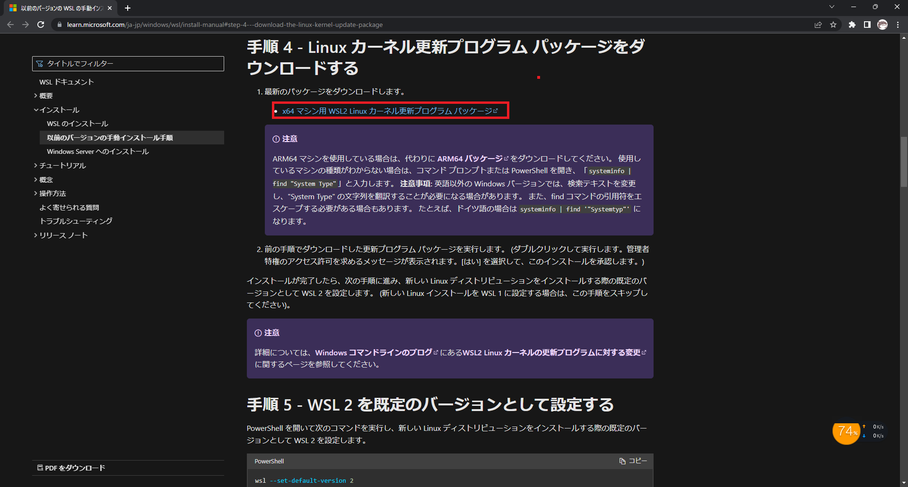

## 4. Linux ディストリビューションのインストール
**PowerShellを管理者権限で開き実行すること**

### 4.1. 一覧取得
```
wsl --list --online
```

### 4.2. インストール
```
wsl --install -d Ubuntu-20.04
```  
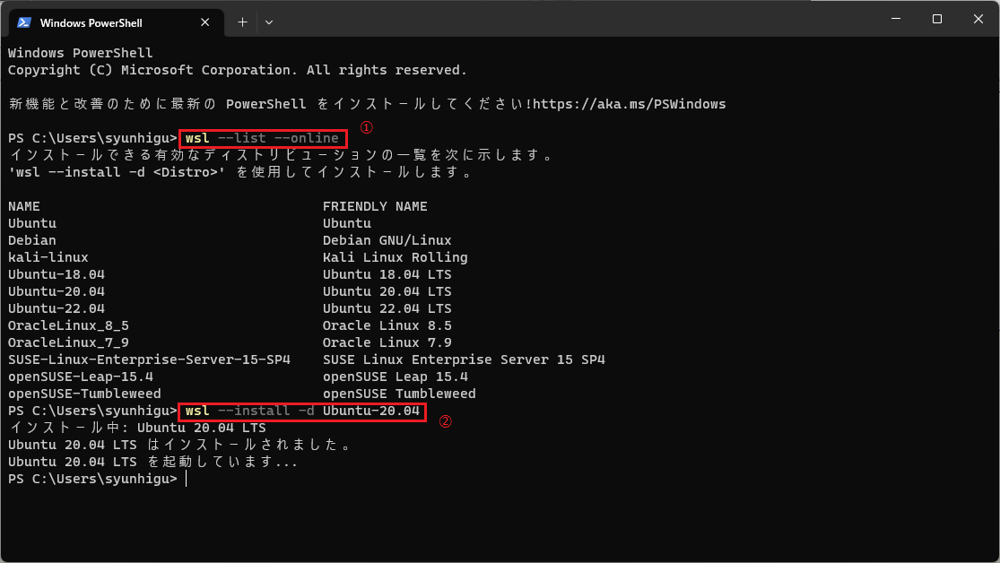  

### 4.3. ユーザ名とパスワードを設定  
Ubuntuインストール後、ユーザー設定画面が開くのでそのまま設定する  
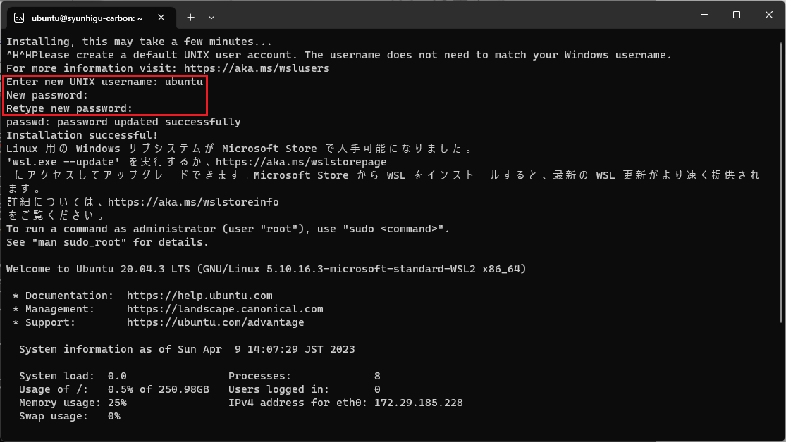  

### 4.4. デフォルトのディストリビューションを変更  
インストール済みのディストリビューション一覧表示
```
wsl -l -v
```
デフォルトのディストリビューションを変更  

```
wsl -s Ubuntu-20.04
```
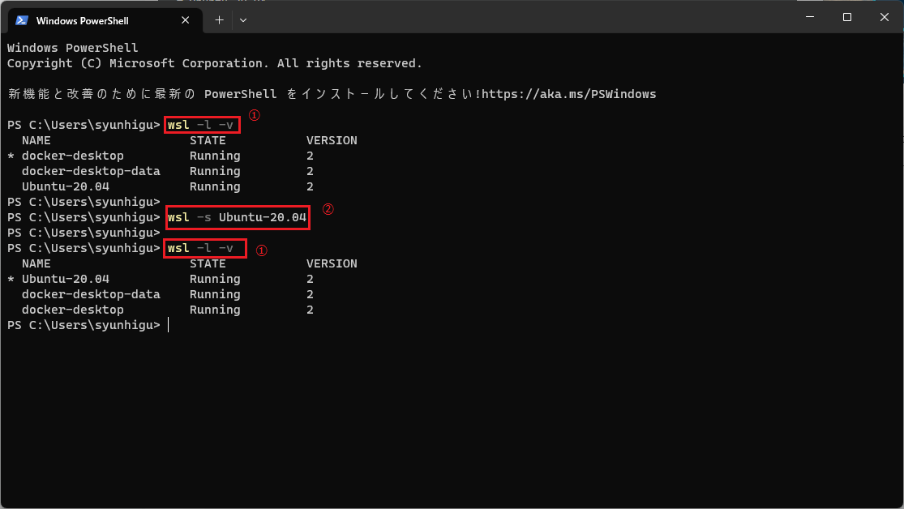

## 5. wsl2上でのdocker使用

### 事前準備  
エクスプローラーでubuntuのディレクトリにアクセスできるか確認
```
\\wsl$\Ubuntu-20.04
```
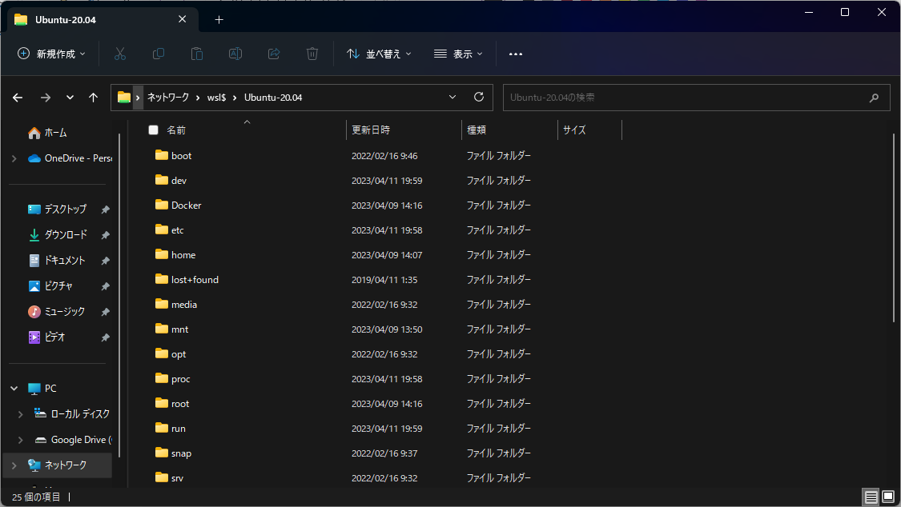  
Dockerデスクトップ起動  
設定画面で「Use the WSL2 based engine」が有効になっていることを確認  
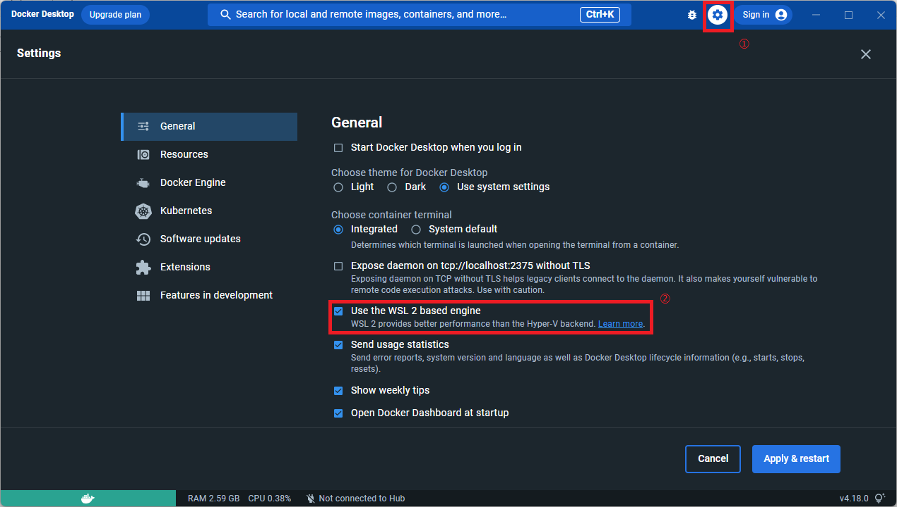  
そのあと「Resources」-「WSL INTEGRATION」を選択し、<br>「Enables integration with additional distros:」以下に表示されているLinuxからDockerを使用するものの設定を有効にし、<br>「Apply & Restart」ボタン押下  
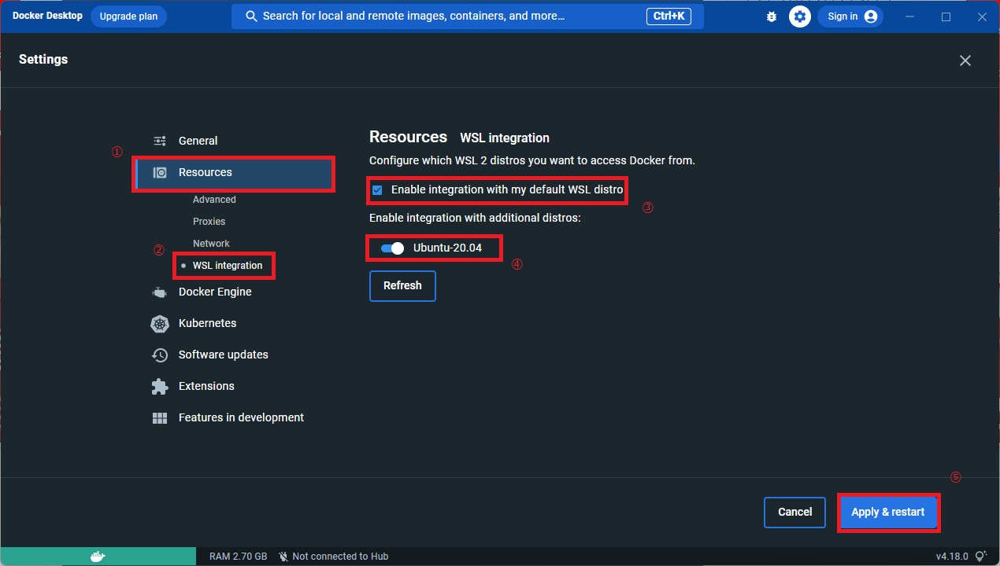  
以下コマンドをディストリビューション上で実行して**Dockerコマンド**が使えることを確認  
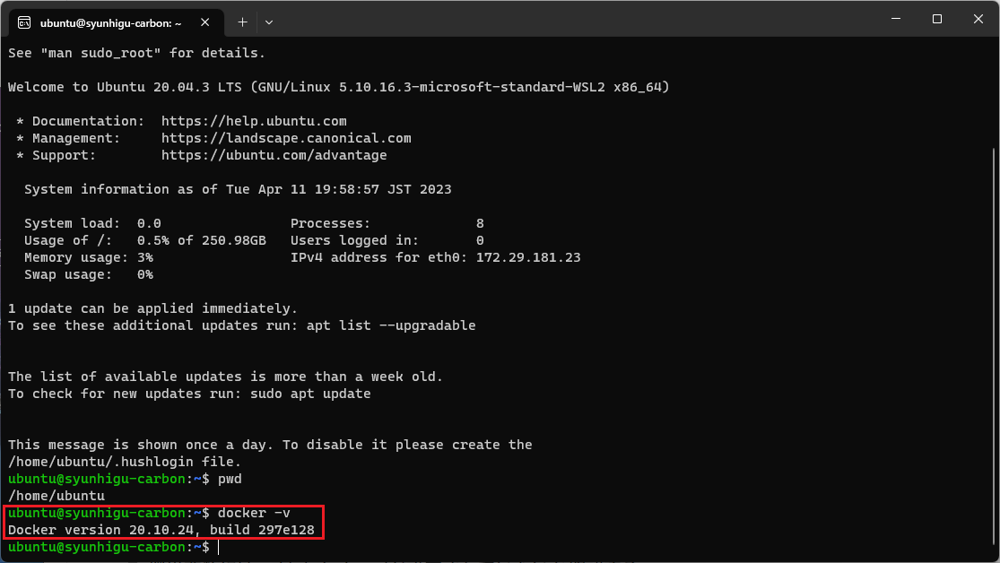
