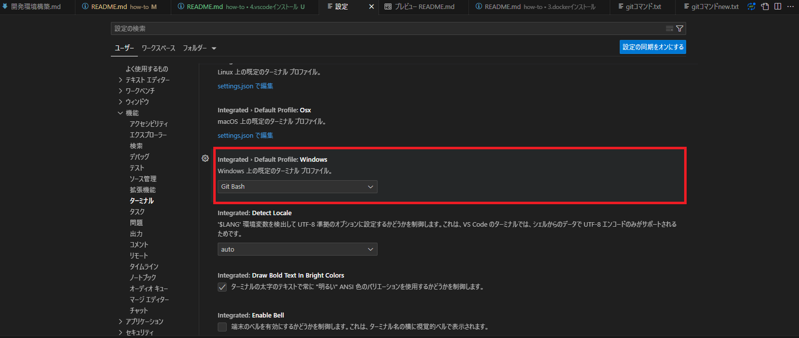

# VS Codeインストール及び設定

## 1. ダウンロード及びインストール
* 下記サイトよりダウンロード及びインストールする  
https://azure.microsoft.com/ja-jp/products/visual-studio-code/  
[参考サイト](https://sukkiri.jp/technologies/devtools/vscode_win.html)  

## 2. 拡張機能インストール
必要そうな各拡張機能をインストールする  
https://tech.nri-net.com/entry/using_docker_containers_with_vscode  
https://chigusa-web.com/blog/vs-code%E3%81%A7docker%E3%81%AEpython%E7%92%B0%E5%A2%83%E3%81%A7%E3%83%AA%E3%83%A2%E3%83%BC%E3%83%88%E9%96%8B%E7%99%BA/  

| 分類 | 拡張機能名 | URL |
|--|--|--|
| 必須 | Japanese Language Pack for Visual Studio Code | https://marketplace.visualstudio.com/items?itemName=MS-CEINTL.vscode-language-pack-ja |
| 必須 | Dev Containers | https://marketplace.visualstudio.com/items?itemName=ms-vscode-remote.remote-containers |
| 任意 | Remote Development | https://marketplace.visualstudio.com/items?itemName=ms-vscode-remote.vscode-remote-extensionpack |
| 任意 | Git Graph | https://marketplace.visualstudio.com/items?itemName=mhutchie.git-graph |
| 任意 | Git History | https://marketplace.visualstudio.com/items?itemName=donjayamanne.githistory |
| 任意 | Git History Diff | https://marketplace.visualstudio.com/items?itemName=huizhou.githd |

## 3. 設定
https://blanche-toile.com/web/settings-visual-studio-code  
https://rfs.jp/sb/vsc/vsc-setting.html  
おすすめ設定  
* デフォルトのターミナルをGitBashに変更する  
  
* タブサイズを「半角スペース2つ」にする  
  
* 改行コードを「LF」にする  
  
* 空白文字の表示  
  
