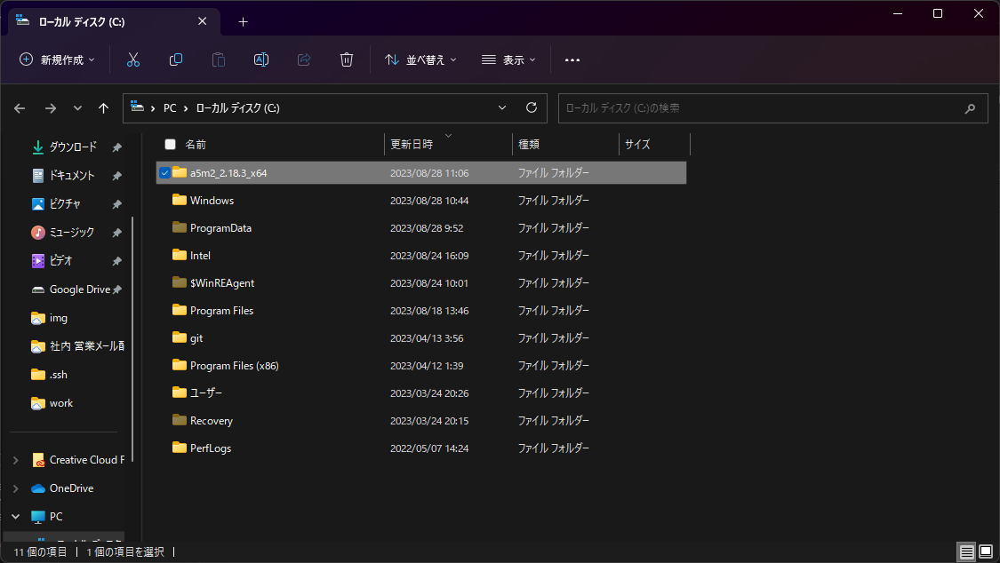
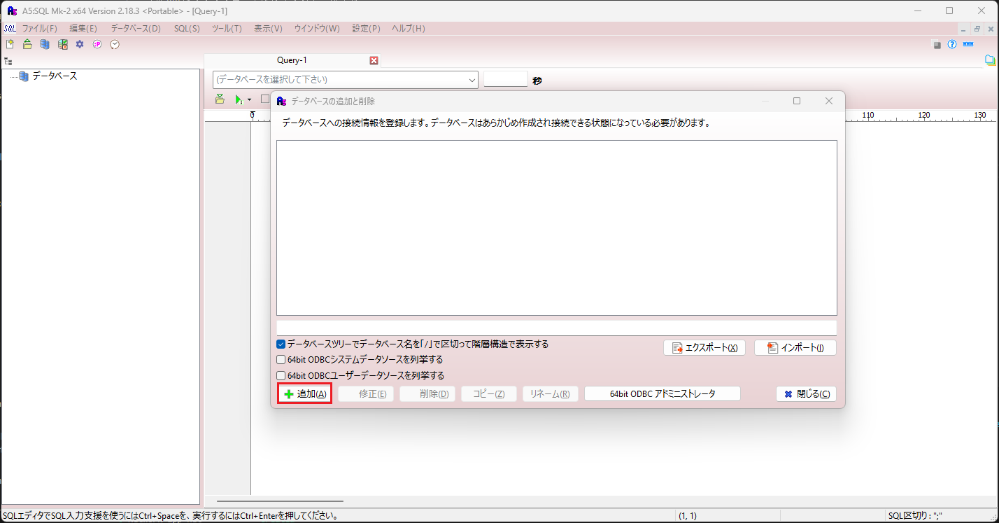
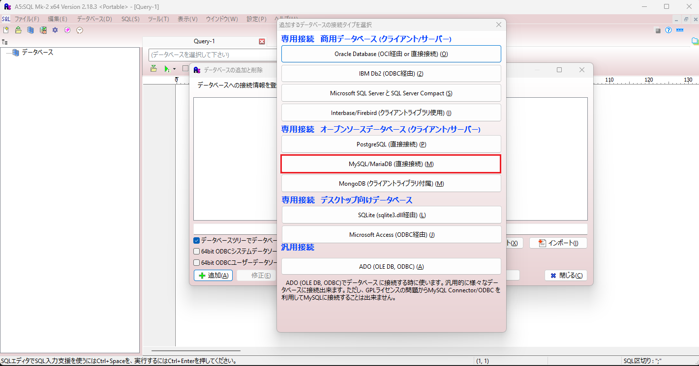
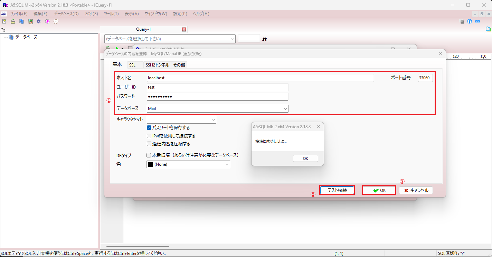

# VS Codeインストール及び設定

## 1. ダウンロード及びインストール
* 下記URLよりダウンロード及びインストールする  
**※おすすめは「Vector」**  
https://a5m2.mmatsubara.com/  

* 適当なフォルダに展開したフォルダを配置する  
  

## 2.起動及び設定  

### 2.1. ポータブルモードでの起動  
「①設定ファイル（ポータブルモード）」選択　→　「②起動」ボタン押下　→　「③OK」ボタン押下  

### 2.2. データベースの追加
* データベースの追加と削除画面から、「追加」ボタン押下  
  

* 追加するデータベースの選択  


* データベース内容登録及び接続確認
下記①内容を入力し、「②テスト接続」ボタン押下で成功確認後、「③OK」ボタン押下
**※docker-compose.ymlの内容を入力**  
```
ホスト名
パスワード
ユーザーID
パスワード
データベース
```
  
