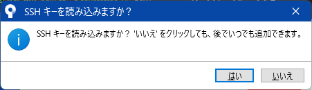

# Source Treeインストール及び設定

## 1. ダウンロード及びインストール  
下記URLよりダウンロード及びインストールする  
https://www.sourcetreeapp.com/  
[参考サイト](https://sukkiri.jp/technologies/devtools/git/sourcetree_win.html)

### 1.1. ダウンロードしたインストーラーを実行  

### 1.2. Install  
下記画面で「スキップ」ボタン押下  
  

### 1.3. Registrasion  
下記画面で「次へ」ボタン押下  
  
Mercurialは不要であればチェックを外す  
※「Mercurial」は分散バージョン管理システム  

### 1.4. ツールをインストール  
ツール（Mercurial）のインストールを選択した場合は上のような画面が表示されるので、「次へ」ボタン押下  
  

### 1.5. sshキー読み込み  
SSHキーを読み込むかどうかのポップアップが表示される。  
SSHキーがある場合は、「はい」を選択し、対象キーを読み込み、  
特に無い場合、また後で設定する場合は「いいえ」を押してスキップする。  
ここでは、「いいえ」ボタン押下  
  

### 1.6. インストール完了  
起動画面が表示されればインストール完了  
  

## 2. 設定  

### 2.1. ユーザー名とメールアドレスを設定  
画面上部のメニューから「ツール＞オプション」を選択  
  
次のようにユーザー名とメールアドレスを入力  
  

### 2.2. SSHクライアントの設定
次のようにSSHキー、SSHクライアントを設定し、「OK」ボタン押下して準備完了    
SSHキー：使用するSSHキー  
SSHクライアント：OpenSSH  
  
