# Dockerインストール

## 前提条件
* OSはWindows11

## 1. Windos機能有効化
Windowsの機能の有効化または無効化を開く  
* 以下機能にチェックをつける  
  * Hyper-v  
  * Linux用Windowsサブシステム  
  * 仮想マシンプラットフォーム  
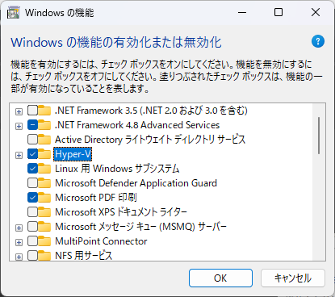  
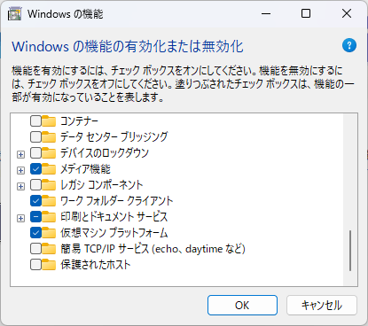

OKボタン押下後、再起動  

## 2. Dockeデスクトップインストール
[Dockerデスクトップ](https://www.docker.com/products/docker-desktop/)よりダウンロード及びインストール  
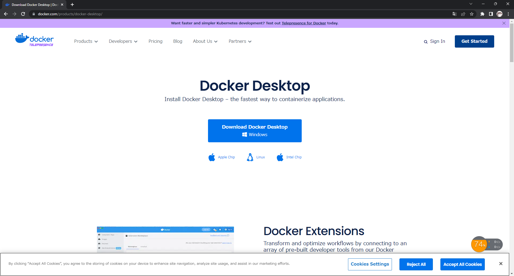

## 3. Linuxカーネル更新プログラムパッケージ
[Linuxカーネル更新プログラムパッケージ](https://learn.microsoft.com/ja-jp/windows/wsl/install-manual#step-4---download-the-linux-kernel-update-package)よりダウンロード及びインストール  
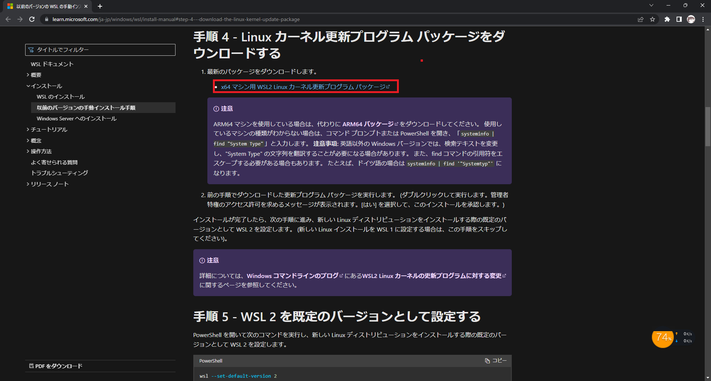

## 4. Linux ディストリビューションのインストール
**PowerShellを管理者権限で開き実行すること**

### 4.1. 一覧取得
```
wsl --list --online
```

### 4.2. インストール
```
wsl --install -d Ubuntu-20.04
```  
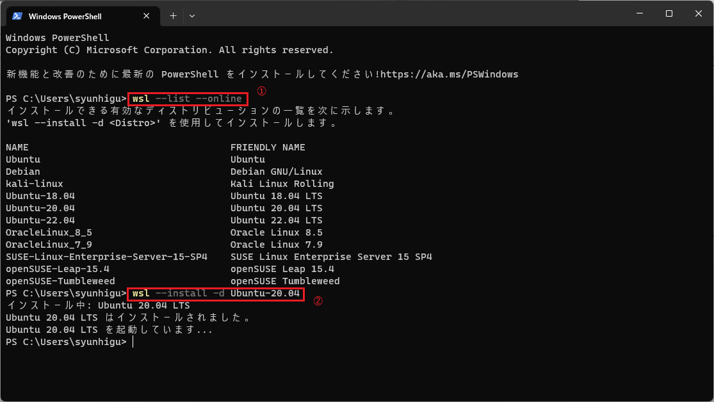  

### 4.3. ユーザ名とパスワードを設定  
Ubuntuインストール後、ユーザー設定画面が開くのでそのまま設定する  
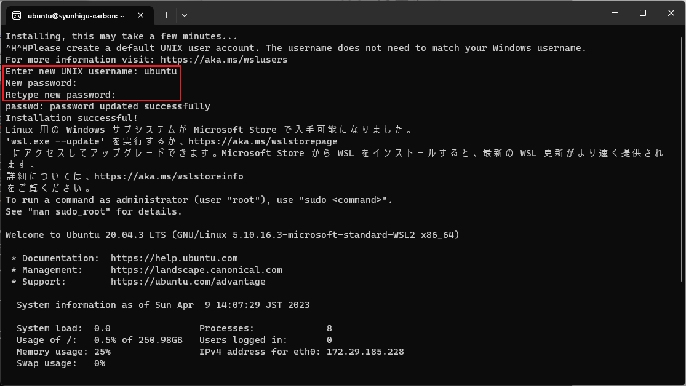  

### 4.4. デフォルトのディストリビューションを変更  
インストール済みのディストリビューション一覧表示
```
wsl -l -v
```
デフォルトのディストリビューションを変更  

```
wsl -s Ubuntu-20.04
```
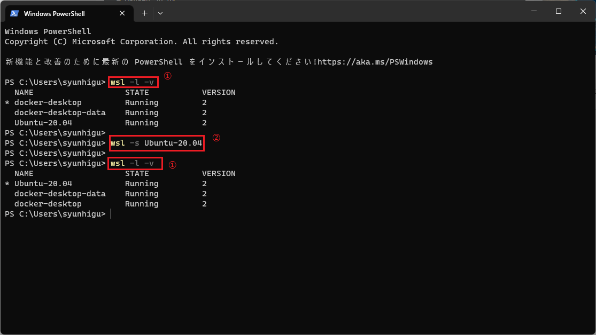

## 5. wsl2上でのdocker使用

### 事前準備  
エクスプローラーでubuntuのディレクトリにアクセスできるか確認
```
\\wsl$\Ubuntu-20.04
```
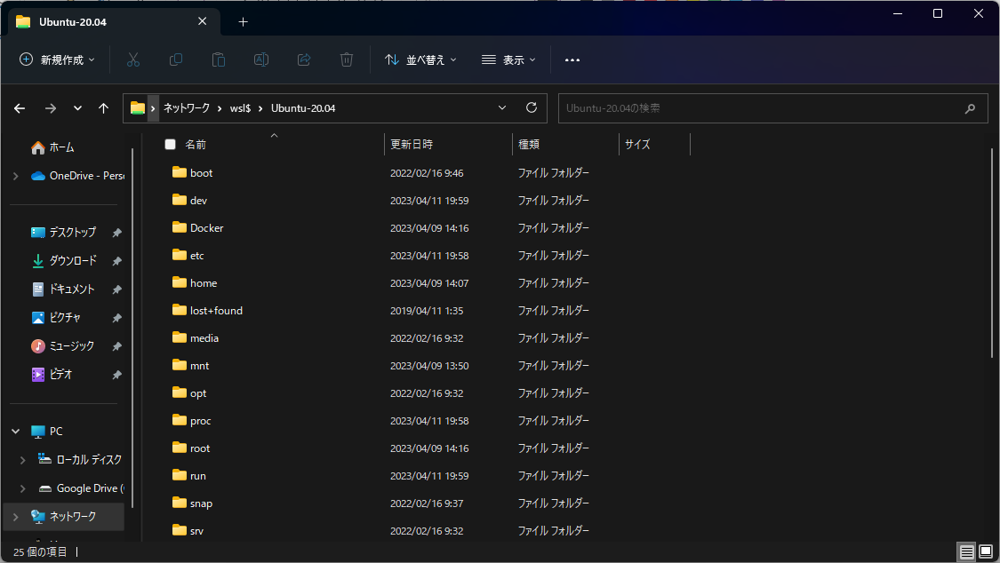  
Dockerデスクトップ起動  
設定画面で「Use the WSL2 based engine」が有効になっていることを確認  
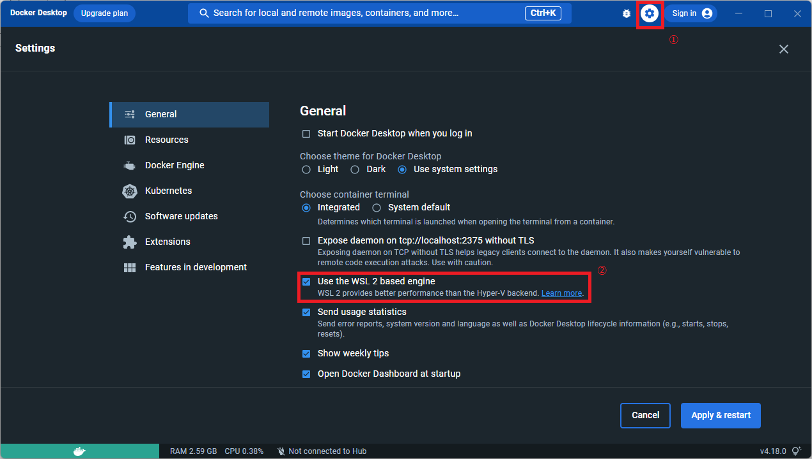  
そのあと「Resources」-「WSL INTEGRATION」を選択し、<br>「Enables integration with additional distros:」以下に表示されているLinuxからDockerを使用するものの設定を有効にし、<br>「Apply & Restart」ボタン押下  
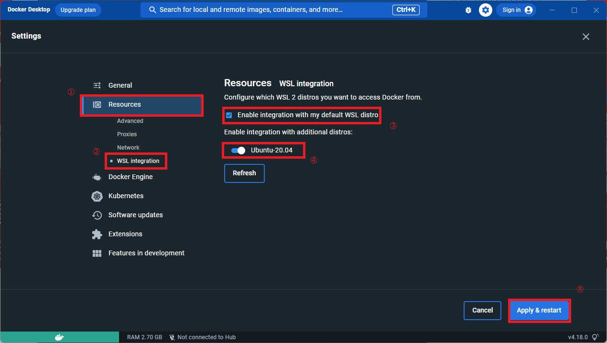  
以下コマンドをディストリビューション上で実行して**Dockerコマンド**が使えることを確認  
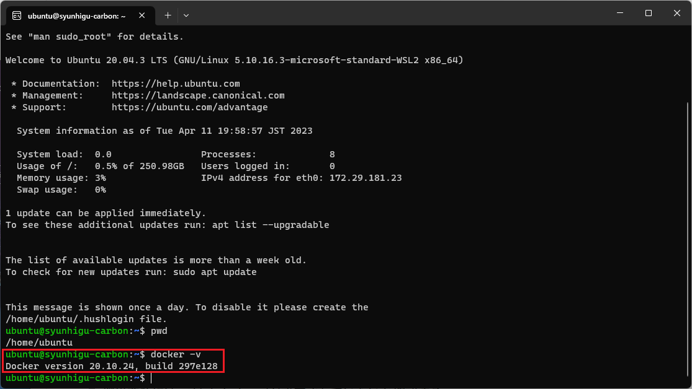
