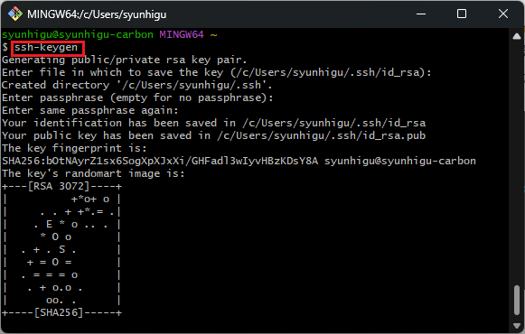
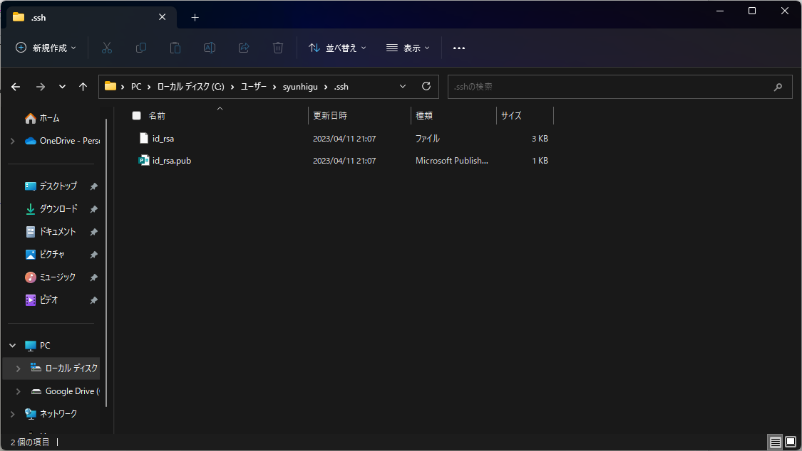
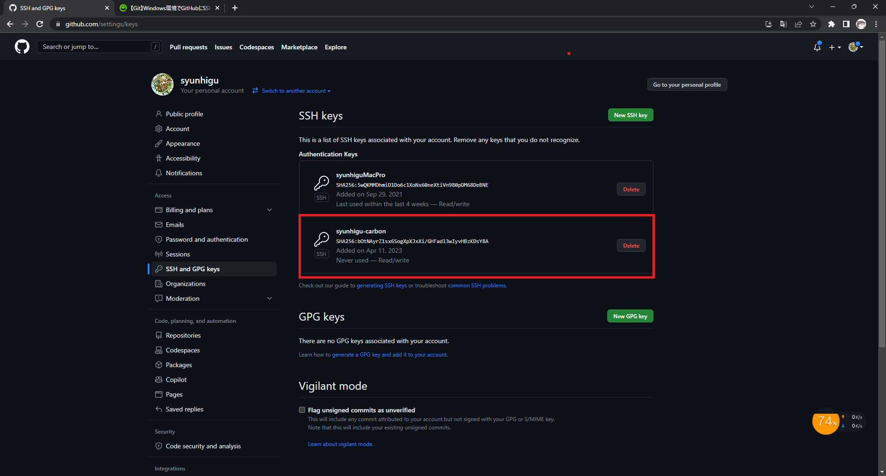

# gitの初期設定

## 前提条件
* WindowsにGitがインストール済みである
* GitHubのアカウントが作成済みである

## 1. 初期設定
以下をGit Bashで実行
```
git config --global user.name "ユーザー名"
git config --global user.email "メールアドレス"
git config --global core.quotepath false #日本語ファイル名がエスケープされないように
```

## 2. 秘密鍵と公開鍵を作成
```
ssh-keygen
```  
  
※パスフレーズはいらなければそのままEnter  
#keyを作成するか聞かれるのでEnter  
#パスフレーズを入力  
#パスフレーズを再入力  
秘密鍵と公開鍵は下記ディレクトリに作成される  
  
⇒ユーザホームディレクトリに.sshディレクトリを作成  
⇒そして、.sshディレクトリの中に秘密鍵と公開鍵を生成

## 3. GitHubに公開鍵を設定
生成した公開鍵(rsa.pub)をテキストエディタで開き、中身を全てコピーする。  
GitHubにアクセスし、下記の手順通りに公開鍵を登録する。  
1. GitHubにログインし、右上のメニューから Settings を選択
2. SSH and GPG keys を選択
3. New SSH Keyを押下
4. Title(自由)、Key(コピーした内容をペースト)を入力して Add SSH keyを押下  
以下のように登録される  
